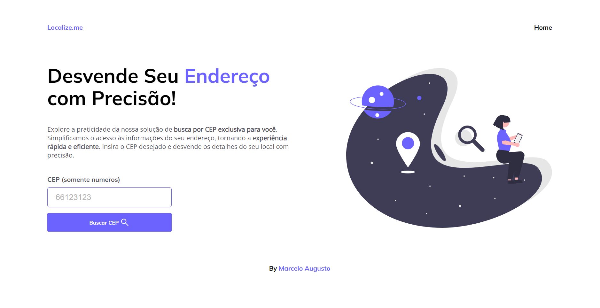

# Projeto API CEP 🌏
<h1>
     
    <a href="https://marceloaugusto33.github.io/Projeto-API-CEP/">PROJETO EM AÇAO!!</a>
</h1>

## 📕 SOBRE

Este projeto consiste em uma aplicação web simples para consultar informações de CEP (Código de Endereçamento Postal) utilizando uma API pública. A aplicação foi desenvolvida utilizando HTML, CSS e JavaScript.

## 🔨 FERRAMENTAS

- [HTML](https://developer.mozilla.org/pt-BR/docs/Web/HTML)
- [CSS](https://developer.mozilla.org/pt-BR/docs/Web/CSS)
- [JAVASCRIPT](https://developer.mozilla.org/pt-BR/docs/Web/JavaScript)

## 📃 LICENÇA
Esse projeto utiliza licença MIT. Veja o arquivo da [licença](https://github.com/MarceloAugusto33/PROJETO-API-CEP/blob/main/LICENSE) para mais detalhes.
